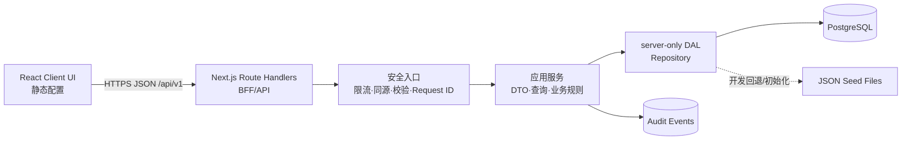

# LumaFlow 后端架构方案（v1）

## 1. 数据真假与边界

“静态/动态”不代表“假/真”，而代表数据的所有者和生命周期：

| 分类 | 所有者 | 示例 | 代码位置 |
|---|---|---|---|
| 前端静态配置 | 前端发布包 | 导航名称、页面标题、按钮文案、推荐提问模板 | `src/config/ui-static.ts` |
| 后端动态数据 | 后端/数据库 | 产品、SKU、库存、成本、客户、会话、报价、跟进、日志、统计 | `/api/v1/*` |
| JSON 种子数据 | 后端启动/开发环境 | 无 PostgreSQL 时的可审查演示数据，以及数据库初始化数据 | `src/data/*.json` |
| 密钥和连接信息 | 服务器环境 | `DATABASE_URL`、`API_WRITE_TOKEN` | `.env.local`，禁止提交 |

浏览器不再直接导入 `src/data/*.json`。页面先显示静态加载状态，收到 `/api/v1/bootstrap` 的动态响应并通过 Zod 契约校验后，才渲染产品和业务模块。

## 2. 推荐架构

当前阶段采用“模块化单体 + BFF”最合适：部署简单、事务边界清晰，也避免在业务尚未稳定时过早拆微服务。

代码分层：

- `src/config`：只允许前端静态展示配置。
- `src/lib/contracts`：前后端共享的 API DTO 和 Zod 运行时契约。
- `src/app/api/v1`：薄 Route Handler，只处理 HTTP、授权和响应。
- `src/lib/server`：`server-only` 数据访问、安全门禁和 PostgreSQL 连接。
- `src/lib/*.ts`：无 I/O 的领域类型和纯业务计算。
- `src/hooks`：浏览器 API 客户端和加载/失败/刷新状态。

## 3. 技术栈

- 运行时：Node.js 22 LTS。
- Web/BFF：Next.js 16 App Router Route Handlers。
- 前端：React 19 + TypeScript strict。
- 数据库：PostgreSQL 16+。
- 驱动与连接池：`pg`。
- 契约校验：Zod 4。
- 测试：Vitest；浏览器验收使用真实开发/生产服务。
- 部署建议：单个 Next.js Node 服务 + 托管 PostgreSQL；对象附件后续接 S3 兼容存储。
- 观测建议：结构化日志 + OpenTelemetry + Sentry；多实例限流接 Redis/Upstash。

不建议现阶段引入独立 Express/Nest 服务：它会复制鉴权、DTO、部署和错误处理，但还没有形成需要独立扩缩容的服务边界。当消息接入、AI 检索或报价计算形成独立负载后，再分别拆出 worker/service。

## 4. PostgreSQL 数据设计

v1 采用聚合根 JSONB：`products`、`customers` 等表以 `id` 为关系主键，以 `data JSONB` 保存快速变化的业务结构；常用字段通过表达式索引约束和加速。它适合当前原型快速迭代，同时保持 PostgreSQL 的事务、索引和审计能力。

核心表：

- `products`：产品聚合；SKU、型号唯一索引，状态索引。
- `knowledge_entries`：知识内容和审核状态。
- `customers`：客户聚合，包含联系人、会话、需求和客户报价历史。
- `followup_tasks`：独立任务聚合，按客户、状态和截止时间索引。
- `quote_history`：报价摘要和版本。
- `admin_users`：后台用户视图；未来应由身份提供商同步。
- `ai_logs`、`quality_issues`：AI 可追溯性和数据治理。
- `app_settings`：汇率等低频配置。
- `audit_events`：所有持久化写入的不可变审计事件。

当数据量和并发稳定后，v2 应把高频/强关系字段正规化为 `product_assets`、`contacts`、`conversations`、`quotes`、`quote_lines`，JSONB 仅保留扩展属性。迁移时 API DTO 不变，前端无需跟随数据库表结构调整。

## 5. API v1

所有响应都带 `X-Request-Id`，动态响应禁止缓存。详细机器契约见 `docs/openapi.yaml`。

| 方法 | 路径 | 用途 | 状态 |
|---|---|---|---|
| GET | `/api/v1/bootstrap` | 前端首次读取完整动态 DTO 与工作台统计 | 已实现 |
| GET | `/api/v1/health` | 数据库可达性、回退状态 | 已实现 |
| GET/POST | `/api/v1/products` | 产品查询/创建 | 已实现 |
| GET/PATCH | `/api/v1/products/{id}` | 产品读取/局部更新 | 已实现 |
| GET | `/api/v1/customers` | 客户查询 | 已实现 |
| GET | `/api/v1/followups` | 跟进任务查询 | 已实现 |
| PATCH | `/api/v1/followups/{id}` | 更新任务状态 | 已实现 |

读取端点可在本地演示环境使用 JSON 回退；写入端点只允许写 PostgreSQL，不会修改 Git 中的 JSON 种子文件。

## 6. 安全设计

已落地：

- 数据库模块标记为 `server-only`，连接串不进入浏览器包。
- 所有输入和后端输出均经过 Zod 校验；JSON 请求限制为 256 KB。
- SQL 值全部参数化；动态表名仅允许内部联合类型白名单。
- 默认禁用持久化写入。写入需同源且显式启用 `DEMO_WRITES_ENABLED=true`，或使用服务器间 Bearer `API_WRITE_TOKEN`。
- 写入记录 `audit_events`，并关联 Request ID。
- 单实例内存限流，错误响应不泄露堆栈或数据库凭据。
- 默认同源，无宽泛 CORS；响应包含防嗅探、防嵌入、Referrer 和 Permissions Policy 等安全头。
- `.env.local` 被 Git 忽略，仓库只保存无秘密的 `.env.example`。

上线前必须补齐：

- 接 Auth.js 或企业 OIDC，使用 HttpOnly、Secure、SameSite Cookie。
- 在每个服务方法内执行 RBAC/资源级授权，不能只隐藏前端按钮。
- 多租户时所有业务表增加 `tenant_id`，并启用 PostgreSQL Row Level Security。
- 将限流迁移到 Redis；敏感字段加密/脱敏；备份和密钥轮换纳入运行手册。
- 对附件使用短时签名 URL、病毒扫描和 MIME/魔数双重验证。

## 7. 数据流验证标准

1. `/api/v1/bootstrap` 返回 `meta.source`、`requestId` 和 `generatedAt`。
2. 页面显示“动态数据 · JSON/PostgreSQL/JSON 回退”。
3. API 中产品数量、第一条产品 ID 与页面渲染一致。
4. 暂时修改 JSON 种子并重启时，API/UI 同时变化；前端静态配置不变化。
5. 配置 PostgreSQL 后执行 `npm run db:setup`，`/api/v1/health` 的 `database.reachable` 应为 `true`，页面来源应为 `PostgreSQL`。

## 8. 当前边界

- 已实现真实的前后端读取通信和 PostgreSQL 写入端点。
- 当前本机未提供真实 `DATABASE_URL`，因此只能验证 JSON 读取和数据库故障回退，不能声称已连接用户的 PostgreSQL。
- 现有 UI 的新增/编辑交互仍以本地会话为主；API 已具备持久化端点，下一步逐模块把表单提交切到写 API，并接入真实身份授权。
