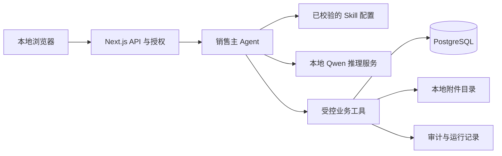

# LumaFlow：可本地部署、持续积累的销售 Agent 方案

本文根据本轮两张业务截图和现有代码设计后续版本。它是一份实现蓝图，不代表下述记忆、导入、任务和权限模块已经完成。截图内的客户姓名、电话号码和聊天内容不作为公开演示数据或测试数据。

## 1. 产品定位与截图中的实际需求

目标是让使用者在自己的电脑或公司内网安装 LumaFlow，通过本地 Qwen 模型、自己的产品资料和销售记录运行一个销售 Agent；日常使用不依赖必需的付费模型 API。每个使用者保有自己的业务数据、业务规则和运行记录，并能导出、迁移与删除。

图一描述的是一条销售流程：线索进入 → 电话开发 → 加微信或转介绍 → 客户分组 → 内容草拟与周期联系 → 产品资料和标准报价 → 定制需求转负责人 → 记录跟进与成交。图二补充了目前承载这条流程的 Excel：客户、联系方式、业务员、咨询需求、聊天凭据、联系结果、日期和多次后续更新。截图没有完整显示所有表头，因此导入时必须让使用者确认字段映射，不能直接把推测的列含义当作确定事实。

优先解决的问题是：业务员不必反复找资料、回忆客户、翻表和写总结；负责人能够追溯“为什么推荐这个产品、为什么今天跟进、这个结论来自哪次沟通”。截图中的“每日四条内容”“两至三天联系一次”“每个标签五百人”属于该公司的业务做法，可以成为可修改配置，不应写成通用的平台规则。

## 2. 一个主 Agent，多个可版本化的业务 Skill

第一版采用一个销售主 Agent，根据任务加载相关 Skill、调用后端工具并生成待确认结果。不需要同时运行九个模型或九个自主 Agent。只有以后确有独立长任务，例如批量文档解析，才拆出后台 worker。

| 概念 | 在 LumaFlow 中的作用 | 示例 |
|---|---|---|
| Agent | 接收任务、选择流程、决定下一次工具调用、整理结果 | “找这个客户上次要的灯，并拟一段跟进话术” |
| Skill | 有版本、有输入输出要求、有适用范围的业务流程 | 客户跟进：查事实 → 判断未解决项 → 拟建议 → 等确认 |
| Tool | 后端明确授权的可执行能力；参数校验和权限判断由代码承担 | 查询 SKU、读取客户事件、创建待办草稿 |
| Memory | 可持久化、可检索、有来源且可修正的业务信息 | 某客户关注暖光、此结论来自某次已确认沟通 |

Skill 文本本身不能授予权限；写入、报价确认、发送消息等权限必须由后端工具检查。用户资料、导入表格、聊天截图和检索结果都是待处理的数据，不能成为覆盖系统规则的指令。

| Skill | 图中对应工作 | 输入与输出 | 所需工具与边界 |
|---|---|---|---|
| 导入与建档 | 电话名单、Excel 跟进表 | 表格/截图 → 字段映射、去重候选、待确认客户和事件 | 解析工作簿、读取本地附件、客户去重；确认后才写入 |
| 需求整理 | 咨询灯型、尺寸、价格、数量 | 对话与凭据 → 已知需求、未知项、下一步提问 | 客户历史读取、来源引用；缺失值保持未知 |
| 产品资料 | 找图片、参数、证书 | 已确认需求 → 有 SKU 的候选和资料包草稿 | 产品查询、库存查询、附件读取；规格取后端数据 |
| 标准报价 | 基础销售直接报价 | SKU、数量、客户规则 → 后端计算的报价草稿 | 价格库和计算工具；模型不能算最终金额或确认发送 |
| 定制升级 | 非标产品由负责人对接 | 定制需求 → 差异清单、缺失参数、交接草稿 | 任务草拟、负责人查询；不承诺未批准的价格与交期 |
| 客户跟进 | 未回复、待数量、已发样品等 | 事件历史与待办 → 建议时间、理由、话术草稿 | 客户事件和待办工具；任务确认与消息发送分别控制 |
| 内容草拟 | 朋友圈内容、客户激活 | 已批准产品资料与客户分组 → 可编辑内容草稿 | 发布资料检索；不内置无授权的抖音抓取或微信群发 |
| 日报与复盘 | 开发量、报价跟进、成交统计 | 已记录事件 → 可核对的统计与问题清单 | 后端聚合查询；每项指标有时间范围和口径 |
| 记忆整理 | 下次服务能接着上次继续 | 新事件与人工修正 → 记忆候选、冲突、通用经验候选 | 来源查询、确认和版本工具；不把模型猜测直接记成事实 |

Skill 建议采用服务端版本化配置，至少包含 `id`、`version`、`title`、`description`、`instructions`、`allowedTools`、`requiredInputs`、`outputContract`、`reviewPolicy`、`evaluationCases`。已有能力和规划能力应有明确状态，运行时只开放已经实现且通过权限检查的工具。加载器需要校验配置并记录本次运行使用的 Skill 版本；仅在目录里放一个文件，不等于 Agent 已经读取和执行它。

## 3. “可以积累”具体积累什么

| 层次 | 保存什么 | 写入方式 | 检索与修正 |
|---|---|---|---|
| 事实与事件 | 原始消息、导入来源、联系结果、已确认需求、报价状态 | 原始导入保留来源；业务写入有操作者和时间 | 可回到文件、工作表、行号或消息；更正保留版本 |
| 客户记忆 | 当前偏好、预算范围、未解决问题、已作承诺 | Agent 提候选，业务员确认；每条关联事实 | 仅在授权客户范围内检索；冲突不静默覆盖 |
| 通用经验 | 经确认有效的话术、选型经验、常见异议处理 | 去除客户身份信息后由负责人审核 | 标注适用产品、场景、失效日期；不跨公司共享 |
| Skill 与评测 | 业务流程版本、纠错案例、通过/失败的测试 | 人审修改，版本发布，离线回归 | 可比较新旧版本效果，也可回滚 |

这四层构成 Agent 的持续积累能力。日常对话不自动训练 Qwen 的模型权重；知识检索、持久化记忆和 Skill 更新已经能够让同一客户下次得到连续服务。未来若要微调模型，应从已授权且去标识的样本单独建立训练流程，保留数据许可、评测和可回滚版本，不能把所有客户聊天默认送去训练。

推荐记忆状态为 `candidate → confirmed → superseded/expired/rejected`。客户说“先看看”只能形成“暂未决定”之类有来源的候选，不能推断成已拒绝、预算不足或已成交。没有联系记录也不等于已经失联。系统应能展示事件发生时间和记录时间，避免把补录时间误当作客户沟通时间。

## 4. 本地部署架构

保留当前 PostgreSQL 选择和 Next.js 前后端工程，先形成可安装的模块化单体。模型作为独立本地服务，通过兼容协议调用；无需为了一个本地产品同时维护 Next.js 和 FastAPI 两套业务 API。



个人安装的必要组件为 Node.js 应用、PostgreSQL、本地模型服务和附件目录。可以提供 Windows 启动脚本、环境检查和可选 Docker Compose；Docker 不是所有用户机器都必须具备的条件。默认监听回环地址，首次安装创建本地管理员，模型服务不直接暴露给局域网。

Redis、MinIO 和 pgvector 暂不作为个人安装的强依赖。队列和定时任务早期可用 PostgreSQL 持久化；附件先存在应用数据目录；产品和客户使用结构化查询，知识库先使用可解释的关键词检索。以后文档量和并发增加，再引入向量检索、对象存储和专用队列。增加这些组件不能替代来源追溯与客户权限过滤。

建议把运行数据放在明确的用户数据目录，与代码仓库分开：

```text
LumaFlowData/
  attachments/       # 原始工作簿、聊天凭据、产品资料
  exports/           # 用户主动生成的数据导出
  backups/           # 数据库与附件的配套备份
  runtime-logs/      # 脱敏运行日志
```

产品包的后续安装验收应覆盖首次初始化、模型检测、数据库迁移、已有数据升级、备份恢复和卸载时保留/删除数据的选择。当前仓库还不能据此宣称已交付“一键安装、任意电脑直接运行”的桌面产品。

## 5. Qwen 与免费使用的实际边界

官方 [Qwen3.8-27B 模型卡](https://huggingface.co/Qwen/Qwen3.8-27B) 标示 Apache-2.0 许可证并提供视觉能力。模型和应用的许可证需要分别处理：本项目代码许可证尚未选定，可考虑 Apache-2.0；正式发布前应核对依赖和模型的上游许可、保留要求的许可证与声明。这里不替项目自动选定许可证。

“免费使用”应表述为：用户能够自行部署并使用本地模型，无必需的付费模型 API；电脑、显卡、存储和电力仍由部署者承担。固定 27B 模型的资源需求与“任意电脑”不兼容。[官方 FP8 文件目录](https://huggingface.co/Qwen/Qwen3.8-27B-FP8/tree/main) 的文件体量约为 30.9 GB，推理还需要额外运行内存，不能承诺 8 GB 显存单卡直接运行该 FP8 配置。

模型配置建议分开公布：

| 配置 | 定位 | 验收要求 |
|---|---|---|
| Qwen3.8-27B / FP8 | 有足够资源的本地工作站或内网推理机 | 真实模型的工具调用、中文业务、视觉、并发与资源实测 |
| 明确命名的小模型或量化版本 | 普通电脑的替代配置 | 在页面显示实际模型名；单独评测，不冒充同一 27B 型号 |
| 协议模拟服务 | 自动化测试与界面联调 | 始终显示“模拟”；不能作为真实推理质量证据 |

[Ollama 的 OpenAI 兼容接口](https://docs.ollama.com/api/openai-compatibility) 提供工具调用和流式协议，可作为本地部署适配方向；特定模型版本、模板、视觉输入和工具解析是否满足业务要求，仍需实机验证。高资源环境可以继续使用已有 vLLM 适配。应用通过配置选择服务和模型，界面应显示实际连接类型和实际模型，不能只把所有连接统一写成“Qwen 已就绪”。

## 6. Excel 和聊天截图导入设计

图二属于业务流水，不是可以直接按一行一客户入库的规范表。导入流程应分为：解析 → 映射 → 识别重复与冲突 → 预览 → 确认写入。

1. 保存工作簿原件和文件摘要，记录导入批次。识别合并的日期分隔行，将日期附到关联业务行；无法确定归属时保留待确认，禁止沿整列无条件填充。
2. 让用户确认客户、电话、业务员、咨询、结果和日期列。电话号码按字符串处理；遮挡、缺失或 OCR 不确定的数字不能补全。
3. 提取内嵌图片并关联原始工作表与单元格锚点。聊天截图可经本地视觉模型/OCR 生成文本候选，保留原图、置信说明和人工修正入口。
4. 将同一客户的多次更新拆为多个事件；每个事件保留原始文本、发生日期、录入日期、来源坐标和导入批次。客户匹配只能生成候选，不能仅凭同名自动合并。
5. 预览新增客户数、新增事件数、重复记录、未知字段和冲突。确认后使用事务入库，重复导入同一批次不能重复创建事件；支持按批次审查和撤销导入产生的记录。

截图中可见“已报价”“未回复”“已下单已发货”“待确定数量”等状态，这些可帮助建立事件分类。分类结果应附来源，不能只根据红色字体或所在列就判定成交。现阶段只拿到图片，尚未获得可解析的实际工作簿，因此不能报告真实客户导入数量或成功率。

## 7. PostgreSQL 目标表设计

以下是未来迁移的建议结构，不表示这些表已建成。沿用现有 `products` 等业务表；对事件、记忆、任务和引用采用独立关系表，避免把不断增长的客户历史全部塞入单个 JSONB。

| 表 | 主要字段 | 约束与用途 |
|---|---|---|
| `workspaces` | `id, name, timezone, created_at` | 独立安装也有工作区边界 |
| `users` / `memberships` | `user_id, workspace_id, role, enabled` | 业务员、主管、管理员的授权来源 |
| `customers` / `contacts` | `id, workspace_id, owner_id, name, phone, stage, created_at` | 电话字符串；电话不强制全局唯一；查询先过滤工作区与授权 |
| `customer_tags` / `customer_tag_links` | `workspace_id, tag_id, customer_id, source_event_id` | 标签定义和客户关系分离；保留来源 |
| `import_batches` / `import_rows` | `id, workspace_id, file_hash, mapping_version, status, row_ref, preview, error` | 批次幂等；映射及确认过程可审查 |
| `attachments` | `id, workspace_id, storage_key, sha256, mime_type, size, original_name` | 文件位于受管目录；下载通过授权接口 |
| `conversations` / `messages` | `id, workspace_id, customer_id, actor, text, attachment_id, occurred_at, recorded_at` | 永久会话与凭据；模型收到的历史来自后端 |
| `customer_events` | `id, workspace_id, customer_id, type, payload, source_message_id, import_row_id, occurred_at, actor_id` | 跟进、需求、报价、订单等事实流水 |
| `customer_memories` | `id, workspace_id, customer_id, kind, content, status, source_event_ids, valid_from, expires_at, supersedes_id, confirmed_by` | 可确认、过期、纠错；来源不为空 |
| `knowledge_lessons` | `id, workspace_id, scope, content, source_event_ids, status, approved_by, version` | 去标识且经审核的通用经验 |
| `followup_tasks` | `id, workspace_id, customer_id, assignee_id, due_at, status, reason_event_id, completed_at` | 有来源的待办；重启后仍存在 |
| `quotes` / `quote_lines` | `id, workspace_id, customer_id, revision, status, currency, sku, quantity, unit_price_snapshot, rule_version, approved_by` | 保存报价时点价格与规则；金额使用定点数/最小货币单位 |
| `agent_runs` / `tool_calls` | `id, workspace_id, customer_id, model, skill_versions, status, tool_name, redacted_input, result_ref, duration_ms` | 追踪本次运行与工具来源；避免记录原始密钥 |
| `skill_versions` / `evaluation_runs` | `skill_id, version, checksum, status, case_set_version, results, created_by` | 配置发布、评测与回滚 |
| `audit_events` | `id, workspace_id, actor_id, action, target_type, target_id, request_id, created_at` | 记录业务变更与审计，不复制全部敏感正文 |

常用索引为客户事件的 `(workspace_id, customer_id, occurred_at)`、待办的 `(workspace_id, assignee_id, status, due_at)`、客户记忆的 `(workspace_id, customer_id, status)`。所有关系引用都应校验同一工作区；不能只在模型提示中要求“不要看别人的客户”。数据库 RLS 与服务层授权配合，多人部署时默认拒绝未授权的客户范围。

## 8. API、确认和安全边界

已有 `/api/v1/assistant/chat` 继续作为前端入口。未来请求包含用户输入、对话 ID 和客户 ID；客户资料、历史消息、工具结果与可见范围全部由后端取出。浏览器不得通过伪造 assistant/tool 消息冒充数据库返回。模型生成的工具参数每次重新进行身份、资源权限与业务规则校验。

建议新增的业务端点：

| API | 用途 |
|---|---|
| `POST /api/v1/imports`、`GET /api/v1/imports/{id}` | 创建导入预览并查询解析结果 |
| `POST /api/v1/imports/{id}/confirm` | 确认映射和冲突处理后事务入库 |
| `POST /api/v1/customers`、`PATCH /api/v1/customers/{id}` | 建档与人工修正 |
| `GET/POST /api/v1/customers/{id}/events` | 读取和记录客户事件 |
| `GET/POST /api/v1/conversations/{id}/messages` | 持久化会话与来源 |
| `GET /api/v1/customers/{id}/memories` | 读取经授权的记忆和来源 |
| `POST /api/v1/memories/{id}/confirm`、`PATCH /api/v1/memories/{id}` | 人工确认、纠错与失效 |
| `POST /api/v1/followups` | 创建有来源的跟进任务 |
| `POST /api/v1/quotes`、`POST /api/v1/quotes/{id}/approve` | 保存草稿与确认报价，动作分开 |
| `POST /api/v1/exports`、`DELETE /api/v1/customers/{id}` | 导出和受控删除 |

上述新增 API 均为方案。写请求需要认证、资源级授权、输入校验和幂等标识；确认动作记录操作者。数据导入、记忆候选、报价草稿、正式确认和外部发送是不同状态。第一版不接自动电话、自动微信群发和抖音后台操作，先让用户复制确认后的草稿；如以后接平台，发送权限与接入规则需单独实现。

附件使用受管存储键，拒绝路径穿越，校验大小、真实 MIME 和文件类型；不执行工作簿宏、公式、附件脚本或从资料中抽出的命令。工具禁止任意 SQL、任意本地文件路径和任意网络请求。日志默认脱敏；模型调用默认只访问用户配置的本地/内网服务。

保留、删除、导出应是产品功能：工作区可配置原始附件、会话、候选记忆和运行日志的保留期限；删除客户时清理其事件、记忆、派生索引和附件引用，独立共享附件通过引用计数处理。审计仅保留政策允许的最小删除记录，避免在审计里留下被删除的正文。备份的保留时间、恢复后删除重放和导出文件清理也须明确。导出应含机器可读 JSON/CSV、附件清单、来源关系和 Skill 版本，不能只导出一份不可迁移的聊天摘要。

## 9. 当前代码与目标之间的距离

当前代码已具备：

- Next.js 前后端通信、服务端 JSON/ PostgreSQL Repository、产品查询与部分写 API。
- Qwen/vLLM 兼容适配、`/api/v1/assistant/chat` 的 SSE 流式响应。
- 六个受控工具：`searchProducts`、`getProductDetails`、`checkInventory`、`searchKnowledge`、`getProductAssets`、`createQuoteDraft`。
- 产品、库存和资料从 Repository 查询；报价草稿由后端计算；工具输出和本地规则候选在页面分别标识。

其中 `searchKnowledge` 当前是关键词检索，`createQuoteDraft` 不持久化报价、不确认订单。协议模拟测试能够证明接口链路工作，不能证明真实 Qwen 的理解、视觉识别和业务判断质量。Repository 支持 PostgreSQL，也不能据此宣称已经连接任一用户的实际数据库。

尚需建设的关键能力包括：真实 Excel 与图片导入、客户/联系人创建和去重、永久会话、客户事件流水、有来源且可确认的记忆、跟进任务新增、定时执行、报价持久化与审批、业务员权限、完整导出/删除、本地安装和升级流程。业务 Skill 配置即使开始被运行时加载，也不等于这些持久化能力已实现。

## 10. 分阶段验收

| 阶段 | 可交付能力 | 必须通过的验收 |
|---|---|---|
| A：可核对的产品 Agent | 实际模型适配、已加载 Skill、六工具、流式草稿 | 真实模型调用工具；SKU/库存取后端；缺失资料保持未知；伪造工具历史被拒绝；显示实际模型与数据来源 |
| B：导入与事实积累 | Excel 映射、附件、客户与事件入库 | 含合并日期行和图片的脱敏样本导入 → 人工确认 → 事务写入 → 重复导入不重复建档 |
| C：客户记忆 | 记忆候选、确认、来源和纠错 | 确认需求 → 关闭并重启应用 → 同客户再次检索仍能引用原始来源 → 修正后旧记忆失效 |
| D：权限与跟进 | 待办新增、到期查询、客户隔离 | 重启后任务保留；不同业务员无权读取对方客户；跨工作区客户和记忆不可见；无法伪造客户 ID 绕过检查 |
| E：复盘与可移植交付 | 日报、通用经验、导出/删除、安装升级 | 统计可回到事件复算；经验审核后才发布；导出可还原；删除后检索无残留；全新电脑按文档完成安装 |

关键演示脚本应贯穿这几步：导入脱敏跟进表 → 确认一位客户的需求 → 生成可核对的产品与报价草稿 → 保存一次跟进 → 退出并重启 → 同客户检索上次事实与未完成事项 → 切换无权限账户无法看到该客户 → 日报中的数字能追到已保存事件。通过这条链，才能把“自己的、可以积累的 Agent”作为已交付能力描述。
